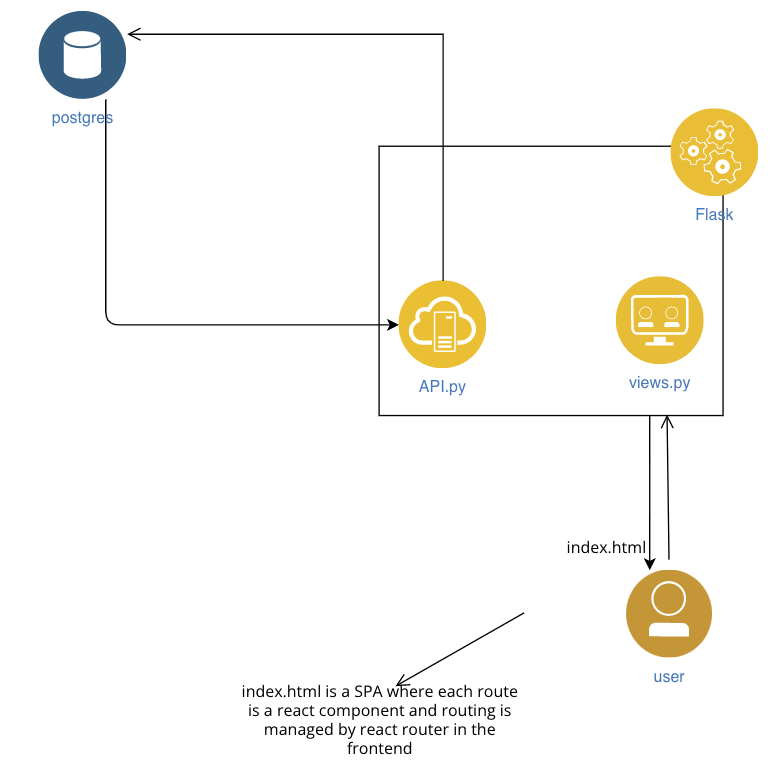
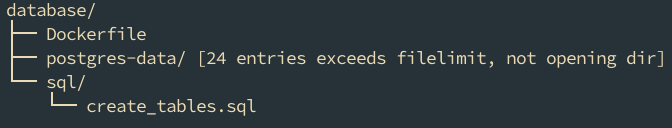
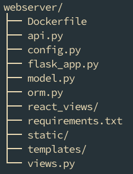

# cardamom-workbench


## quick start

- Make sure you have [docker](https://docs.docker.com/engine/install/) and [docker-compose](https://docs.docker.com/compose/install/) installed
- clone repo
- run docker compose
- then access in your browser localhost:5001

```
    git clone git@gitlab.insight-centre.org:uld/cardamom-workbench.git
    docker-compose up
```

## project structure


- dockerized postgres



### postgres


- postgres_data is where we persist the data from the application (if you want to reset the data just delete this folder)
- if you want to change the db schema just change create_tables.sql but you should reflect the changes on webserver/orm.py


### flask/ UI 

